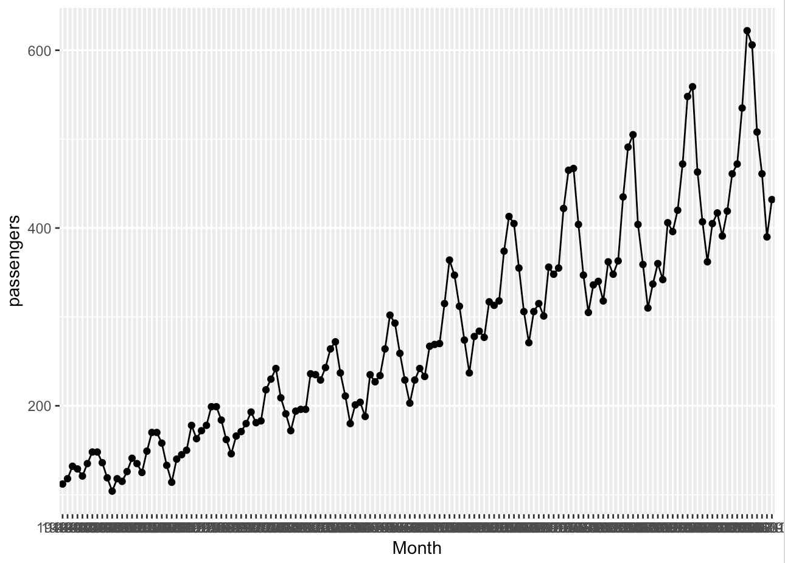
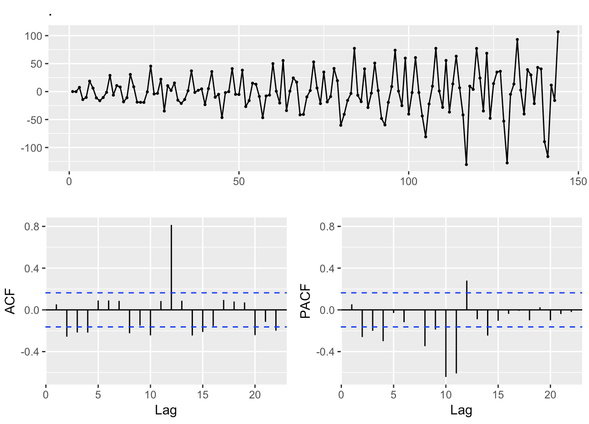

# Learn R (Notes)

```

 .----------------. 
| .--------------. |
| |  _______     | |
| | |_   __ \    | |
| |   | |__) |   | |
| |   |  __ /    | |
| |  _| |  \ \_  | |
| | |____| |___| | |
| |              | |
| '--------------' |
 '----------------' 
```

## Variables

```r
> a <- array(1:20, dim=c(4,5))

> typeof(a)
[1] "integer"

> a[0:5]
[1] 1 2 3 4 5
```
[**c (function)**:](https://www.rdocumentation.org/packages/base/versions/3.5.1/topics/c) Combine Values Into A Vector Or List

### Arrays

```r
x <- 1:4
> is.array(x)
[1] FALSE
> x
[1] 1 2 3 4

> y <- array(1:4)
> y
[1] 1 2 3 4
> is.array(y)
[1] TRUE
```

## Functions

```r
fun = function(x) {
  x * x
}

> fun(3)
[1] 9
```

## Control Flow

### Conditional Statements

```r

if (is.array(y)) {
    print(y)
}
```

### Loops

```r
arr <- 0  ## initialize
for (i in 1:5) {
    arr[i] <- i * i
}
print(arr)
[1]  1  4  9 16 25
```

## Install & Import Libraries

```r
## Install:
## 
install.packages('httr')

## Import into global namespace:
##
library(httr)

## Quantum random number generator :)
##
r <- httr::GET("https://qrng.anu.edu.au/ran_hex.php")

> typeof(r)
[1] "list"

> r$status_code
[1] 200

## response contains hex (8-bits)
##
> hex_str = content(r, "text")
> hex_str
[1] "e2"

> strtoi(hex_str, base=16)
[1] 226

```

### Namespacing

```r
> search()
 [1] ".GlobalEnv"        "package:httr"      "tools:rstudio"     "package:stats"    
 [5] "package:graphics"  "package:grDevices" "package:utils"     "package:datasets" 
 [9] "package:methods"   "Autoloads"         "package:base"

 ## Reference a specific package using ::
 ##
 httr::GET(...)
```

## File Input / Output

```r
> data <- read.csv('data/international-airline-passengers.csv' )# , header=TRUE, sep=",")
> typeof(data)
[1] "list"
```

## Plotting

```r
## https://www.tidyverse.org
##
install.packages('tidyverse')

ggplot2::ggplot(data=data.frame(data), ggplot2::aes(x=Month, y=passengers, group=1)) +
  ggplot2::geom_line()+
  ggplot2::geom_point()
```

<p align="center">
     
</p>

## Forecasting
```r
install.packages('forecast')

library("magrittr")  ## for piping/chaining with %>%

## Seasonal ARIMA
##
data$passengers %>%
  arima(order=c(0,1,1), seasonal=c(0,1,1)) %>%
  residuals() %>%
  forecast::ggtsdisplay()
```
<p align="center">
   
</p>

```r
## Auto ARIMA
##
data$passengers %>%
  forecast::auto.arima() %>%
  residuals() %>%
  forecast::ggtsdisplay()

```
<p align="center">
  
</p>

## Miscellaneous

```r
## Rename an attribute via names(...)
##
> names(data)
[1] "Month"
[2] "International.airline.passengers..monthly.totals.in.thousands..Jan.49...Dec.60"

> names(data)[names(data) == "International.airline.passengers..monthly.totals.in.thousands..Jan.49...Dec.60"] <- "Passengers"

> names(data)
[1] "Month"
[2] "Passengers"
```
